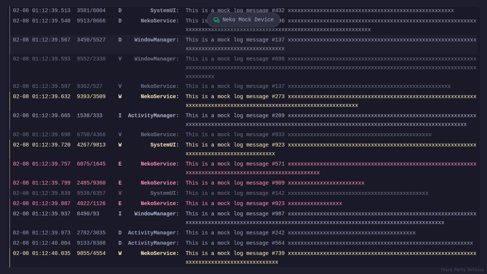

#  NekoLog

[](https://github.com/isofurabon/NekoLog/actions/workflows/test.yml)
[](https://github.com/isofurabon/NekoLog/releases)
[](https://opensource.org/licenses/MIT)
[](https://deno.land/)
[](https://www.typescriptlang.org/)

**Agile, Sleek, Independent.** A modern, browser-based Android Logcat viewer
powered by WebUSB and Web Workers.



NekoLog transforms your browser into a powerful, installation-free Android log
analysis tool. By leveraging the **WebUSB API**, it connects directly to your
Android device without requiring `adb` drivers or server installation on your
host machine.

## ✨ Features

- **Zero-Setup Connectivity**: Connects directly to Android devices via WebUSB.
  No native `adb` or drivers required.
- **Offline Viewing**: Drag & drop support to view local log files with full
  filtering capabilities.
- **High Performance**:
  - **Web Workers**: Offloads heavy log parsing to keep the UI buttery smooth.
  - **Virtualization**: Renders tens of thousands of log lines effortlessly
    using `@tanstack/react-virtual`.
- **Smart Filtering**:
  - **Global Search**: Filter logs instantly with substring matching.
  - **Field Selection**: Isolate searches to specific fields like `Message`,
    `Tag`, `PID`, `TID`, or `Level`.
  - **Shortcuts**: Use `Cmd+K` (macOS) or `Ctrl+K` (Windows/Linux) to focus the
    search bar.
- **Developer Experience**:
  - **Auto-Scroll**: Smart auto-scroll that follows the log stream but pauses
    when you scroll up.
  - **Demo Mode**: Built-in mock log generator for testing and demonstration.
  - **Dark Mode**: Sleek, eye-friendly dark interface.

## 🌐 Browser Support

NekoLog relies on the **WebUSB API** for direct device communication. For full
functionality (connecting to real devices), you must use a **Chromium-based
browser**.

| Browser            | Status           | Version       |
| :----------------- | :--------------- | :------------ |
| **Google Chrome**  | ✅ Supported     | 61+           |
| **Microsoft Edge** | ✅ Supported     | 79+           |
| **Opera**          | ✅ Supported     | 48+           |
| **Other Chromium** | ✅ Supported     | —             |
| **Firefox**        | ❌ Not Supported | — (No WebUSB) |
| **Safari**         | ❌ Not Supported | — (No WebUSB) |

> [!NOTE]
> **Mock Mode** (simulated logs) is compatible with all modern browsers,
> including Firefox and Safari.

## 🚀 Getting Started

### Web Application

**[Open NekoLog](https://isofurabon.github.io/NekoLog/)**

NekoLog is available as a Progressive Web App (PWA). You can use it directly in your browser without any installation.

### Standalone Binary

**[Download](https://github.com/isofurabon/NekoLog/releases)**

You can download the latest standalone binary from the Releases page. No
installation or dependencies (like Deno or Node.js) are required to run the
pre-compiled binary. Just download and execute it.

### 📖 How to Use

1. **Connect Device**:
   - Enable **USB Debugging** on your Android device (Settings > Developer
     Options).
   - Connect it via USB cable.
   - Click the "Connect" button in the top-right header (or the center if
     disconnected).
   - Select your device from the browser popup and grant permission.

2. **Filtering**:
   - Press `Cmd+K` / `Ctrl+K` or click the search icon to open the filter bar.
   - Type to filter logs. The search is case-insensitive.
   - Click the **Filter Icon** inside the search bar to toggle specific fields
     (e.g., search only in `Tag` or `Message`).

3. **Auto-Scroll**:
   - Toggle auto-scrolling using the arrow button in the control bar.
   - Auto-scroll automatically pauses when you scroll up to inspect older logs
     and resumes when you scroll back to the bottom.

4. **File Viewer**:
   - Drag and drop any `.txt` or `.log` file directly into the window.
   - NekoLog will parse and display it instantly, allowing you to use all
     filtering and search features on static files.
   - Large files (>100MB) are supported via efficient chunked processing.

## 🛠️ Development

### Prerequisites

#### 🐳 Container-based (Recommended)

This project is configured with a **DevContainer**. We highly recommend using it
to ensure a consistent development environment without manually installing
dependencies.

**Required Tools:**

- [Docker Desktop](https://www.docker.com/products/docker-desktop/) (or any
  Docker-compatible runtime)
- [Visual Studio Code](https://code.visualstudio.com/)
- [Dev Containers Extension](https://marketplace.visualstudio.com/items?itemName=ms-vscode-remote.remote-containers)

#### 💻 Local Development (Manual Setup)

If you prefer to set up the environment locally on your machine, you must
install the following tools manually:

**Required Tools:**

- [Deno](https://deno.land/) 2.0+
- [Git](https://git-scm.com/)
- A **Chromium-based browser** (Chrome, Edge, Opera, etc.) for WebUSB support.

### Installation

```bash
deno install
```

### Running Locally

```bash
deno task dev
```

### Building for Production

```bash
deno task build
```

### Running Tests

```bash
# Unit tests
deno task test:unit

# All tests (requires Node.js for Playwright)
deno task test:all
```

### Compile to Single Binary (Experimental)

You can compile NekoLog into a standalone executable:

```bash
# Compile for current OS
deno task compile

# Compile for specific OS
deno task compile:win
deno task compile:mac
deno task compile:linux
```

### CI/CD Pipeline

This project uses [Dagger](https://dagger.io) for its CI pipeline. You can run
the CI locally to ensure your changes pass all checks:

```bash
deno task ci
```

## 🛠️ Tech Stack

- **Framework**: React 18+ (TypeScript)
- **Runtime**: Deno 2.0+
- **State Management**: Jotai
- **Build Tool**: Vite
- **Styling**: Tailwind CSS (Utility-first)
- **Color Theme**: [Catppuccin (Mocha)](https://github.com/catppuccin)
- **ADB Integration**:
  [`@yume-chan/adb`](https://github.com/yume-chan/ya-webadb) ecosystem
- **Icons**: Lucide React
- **Font**: [JetBrains Mono](https://www.jetbrains.com/lp/mono/)

## 📄 License

MIT
